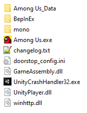

# AmongUsUnknownImpostors

Among us mod that fixes some game breaking bugs when tryharding among us. As well as some useful settings

## 语言

### Add private language

- Create a folder named 'Language' in the game directory
- 下载 [Lang.dat](./AmongUsUnknownImpostors/Language/Lang.dat)
- Open 'Lang. dat' using Notepad and translate it
- Change the name of 'Lang. dat' to the corresponding language name

### Add public language

- Copy 'Lang. dat' from 'AmongUsUnknown Anchors/Language'
- Open 'Lang. dat' in Notepad for translation
- Change it to the corresponding language name and store it in 'AmongUsUnknown Immotors/Language'
- Create a pull request, I will merge and publish it soon after checking for no issues

## Features

-   Impostors don't know each other
-   Impostors can kill each other
-   Impostors are impacted by lights sabotage (it can be individually customized in the lobby settings)
-   The module can be disabled from a lobby command, and will be automatically disabled if the host doesn't have the mod installed
-   Allow you to change map and impostor count from the game lobby (Thx [@Galster](https://github.com/Galster-dev))

## Technical stuff

-   Support Among us v2024.11.26 (Steam and Epic)

### Installation

All players should have the mod install for the best user experience

-   Download the [lastest release](https://github.com/FangkuaiYa/AmongUs-HomemadePlugin/releases).
-   Extract the files into Among us game folder (`steam/steamapps/common/Among us`)
-   This should look like this
    
-   **Run the game from steam**

### Installation side note

If you want to install Reactor by yourself, please follow the [BepInEx](https://docs.reactor.gg/docs/basic/install_bepinex) installation instruction, then [Reactor](https://docs.reactor.gg/docs/basic/install_reactor)'s ones. And then copy the plugin dll (from [releases](https://github.com/Herysia/AmongUsTryhard/releases/latest)) into `Among us/BepInEx/plugins`

### Uninstall

If you want to uninstall this mod only, remove the dll `Among us/BepInEx/plugins/AmongUsUnknownImpostors.dll`.

If you want to disable it, you can temporarily rename or remove the file `Among us/winhttp.dll`

If you want to completely uninstall Reactor/BepInEx, remove the following files and folders

```
+-- BepInEx
+-- mono
+-- changelog.txt
+-- doorstop_config.ini
+-- winhttp.dll
```

# Contributing

You have encountered a bug or unexpected behaviour ? You want to suggest or add a new feature ? Create an [Issue](https://github.com/FangkuaiYa/AmongUs-HomemadePlugin/issues) or [PR](https://github.com/FangkuaiYa/AmongUs-HomemadePlugin/pulls) !

### Creating PR

-   [Fork this on github](https://github.com/FangkuaiYa/AmongUs-HomemadePlugin/fork)
-   Deselect Copy the 'main' branch only
-   Clone your repo, commit and push your changes
-   Request a new Pull request

# Licensing & Credits

AmongUsUnknownImpostors is licensed under the MIT License. See [LICENSE](LICENSE.md) for the full License.

Custom game option code reference [Town-Of-Us-R](https://github.com/eDonnes124/Town-Of-Us-R)

Third-party libraries:

-   [Reactor](https://github.com/NuclearPowered/Reactor) is license under the LGPL v3.0 License. See [LICENSE](https://github.com/NuclearPowered/Reactor/blob/master/LICENSE) for the full License.
-   Unity Runtime libraries are part of Unity Software.  
    Their usage is subject to [Unity Terms of Service](https://unity3d.com/legal/terms-of-service), including [Unity Software Additional Terms](https://unity3d.com/legal/terms-of-service/software).

# Contact

### Email: 2683748223@qq.com
